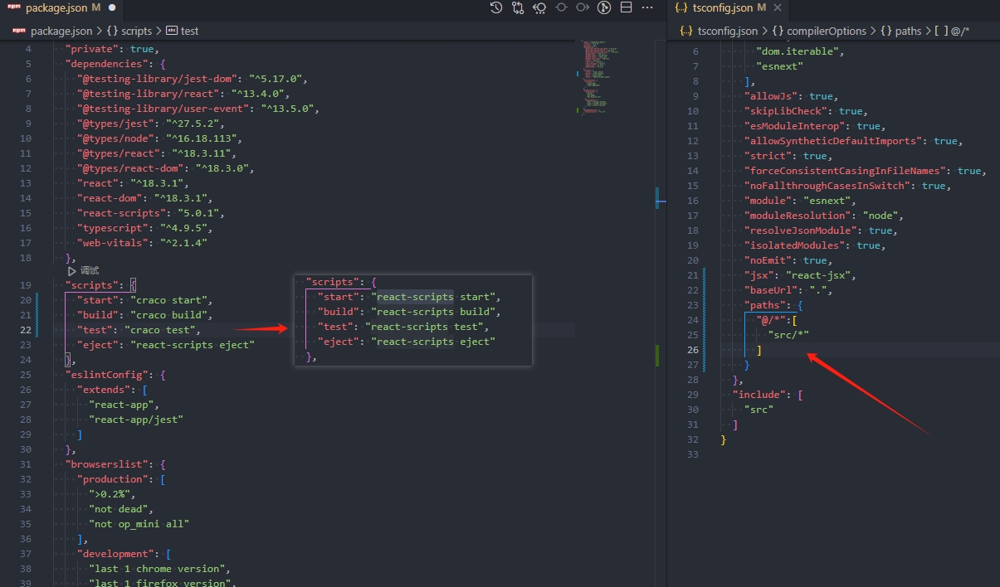
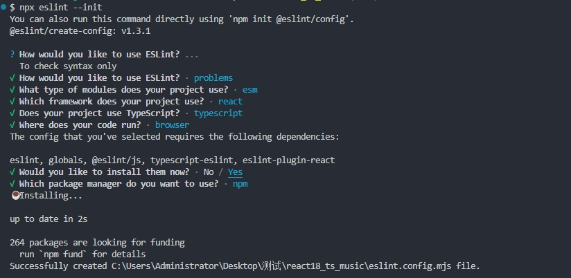

# 一、脚手架创建react-Ts项目

1. 创建项目

   ```shell
    create-react-app 项目名字 --template typescript
   ```

   传统的使用`create-react-app 项目名字`即可,这里需要使用ts因此加入后缀

2. webpack 是隐藏配置,   因此这里使用craco(全程`create-react-app  config `)来配置别名和其他配置,  不推荐使用eject因为会暴露出来所有的

   使用craco安装这里是最新的官方已经更新

   ```shell
   npm i -D @craco/craco
   ```

   注:旧版本

   因为最新版本`"react-scripts": "5.0.1"`因此在命令后加上`@alpha`

   ```shell
   npm install  @craco/craco@alpha -D
   ```

   修改配置--配置项目别名

   

3. 配置.editorconfig文件

   ```
   # http://editorconfig.org
   root = true
   
   # 适用于所有文件
   [*]
   charset = utf-8 #设置文件字符集为 utf-8
   indent_style = space #缩进风格(tab | space)
   indent_size = 2 #缩进大小
   end_of_line = lf #控制换行类型(lf|cr |crlf)
   tab_width = 2 #定义用于表示制表符的列数的整数
   trim_trailing_whitespace = true # 去除行尾的任意空白字符
   insert_final_newline = true # 始终在文件末尾插入一个新行
   
   # 适用于所有 Markdown 文件
   [*.md]
   indent_size = 4
   max_line_length = off
   trim_trailing_whitespace = false
   
   # 适用于 JavaScript 文件
   [*.js]
   indent_size = 2
   
   # 适用于 JSON 文件
   [*.json]
   indent_size = 2
   
   # 适用于 TypeScript 文件
   [*.ts]
   indent_size = 2
   
   # 适用于 HTML 文件
   [*.html]
   indent_size = 2
   # 适用于 CSS 文件
   [*.css]
   indent_size = 2
   
   ```

4. [配置prettier](https://github.com/Liu-linxi/vue3-ts-manage/blob/main/%E9%A1%B9%E7%9B%AE%E6%90%AD%E5%BB%BA%E8%A7%84%E8%8C%83.md)

5. 配置eslint

   1. 安装

      ```shell
      npm install eslint -D
      ```

   2. 初始化

      ```sh
      npx eslint --init
      ```

      


# Getting Started with Create React App

This project was bootstrapped with [Create React App](https://github.com/facebook/create-react-app).

## Available Scripts

In the project directory, you can run:

### `npm start`

Runs the app in the development mode.\
Open [http://localhost:3000](http://localhost:3000) to view it in the browser.

The page will reload if you make edits.\
You will also see any lint errors in the console.

### `npm test`

Launches the test runner in the interactive watch mode.\
See the section about [running tests](https://facebook.github.io/create-react-app/docs/running-tests) for more information.

### `npm run build`

Builds the app for production to the `build` folder.\
It correctly bundles React in production mode and optimizes the build for the best performance.

The build is minified and the filenames include the hashes.\
Your app is ready to be deployed!

See the section about [deployment](https://facebook.github.io/create-react-app/docs/deployment) for more information.

### `npm run eject`

**Note: this is a one-way operation. Once you `eject`, you can’t go back!**

If you aren’t satisfied with the build tool and configuration choices, you can `eject` at any time. This command will remove the single build dependency from your project.

Instead, it will copy all the configuration files and the transitive dependencies (webpack, Babel, ESLint, etc) right into your project so you have full control over them. All of the commands except `eject` will still work, but they will point to the copied scripts so you can tweak them. At this point you’re on your own.

You don’t have to ever use `eject`. The curated feature set is suitable for small and middle deployments, and you shouldn’t feel obligated to use this feature. However we understand that this tool wouldn’t be useful if you couldn’t customize it when you are ready for it.

## Learn More

You can learn more in the [Create React App documentation](https://facebook.github.io/create-react-app/docs/getting-started).

To learn React, check out the [React documentation](https://reactjs.org/).
